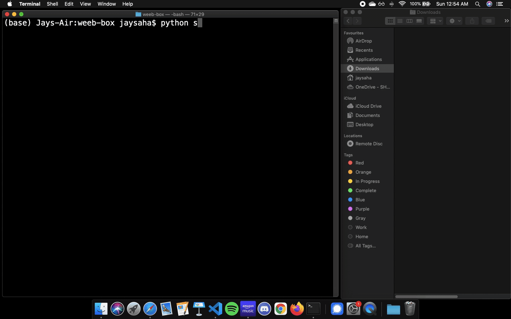
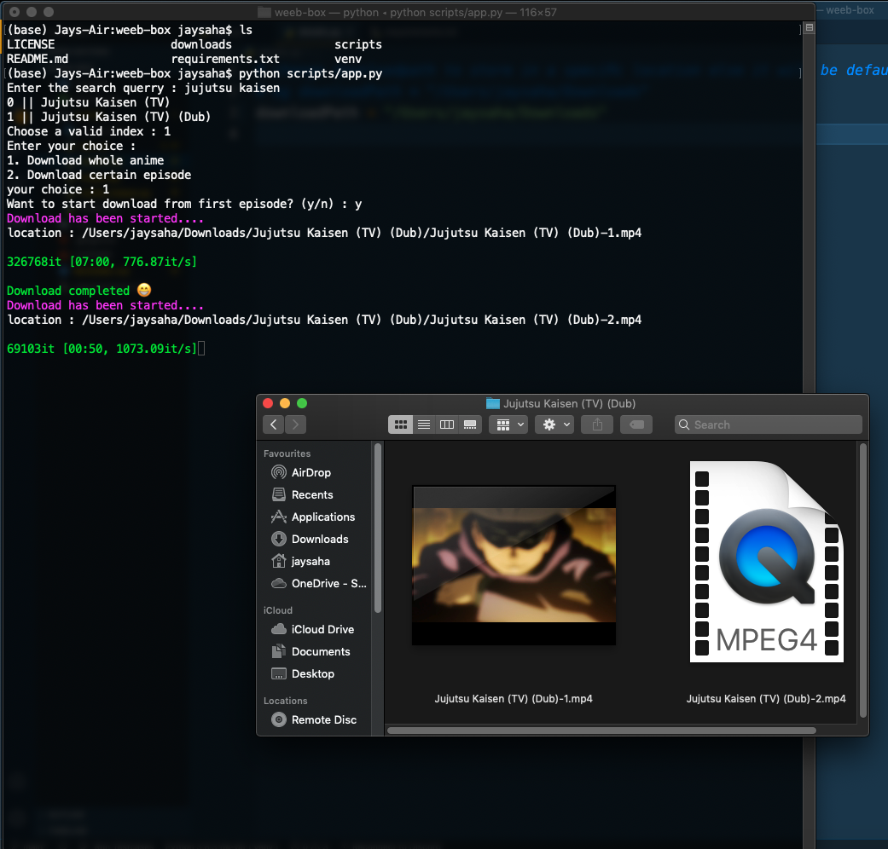
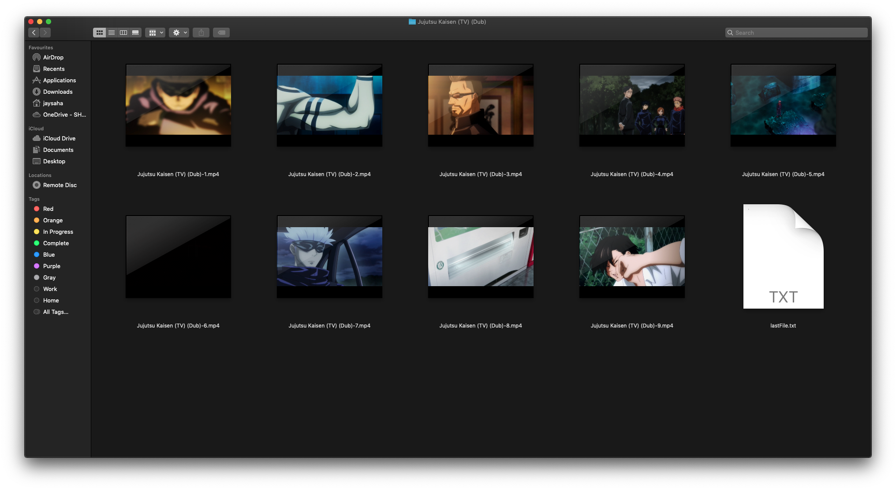

# weeb-box

Python command line application to watch and download animes from popular anime sites. Let's bring the weeb out 🎍

## Supported Sites 🕸

1. Gogoanime

## Functionality 🤖

1. ⬇️ Download whole season or season in parts or single episode
2. 📈 Downloads the video with good quality
3. ⏯ Play the video without downloading but opencv doesn't support audio yet
4. No pop ups or adult adds!

## Main Dependencies 🧰

```
requests
bs4
opencv
```

## How to run? 🏃🏻‍♂️

### 1. Clone the repo

```sh
$ git clone https://github.com/ponder2000/weeb-box.git
$ cd weeb-box
```

### 2. Update the download path

The animes will be downloaded in Download folder inside project directory.
To download in other location update `scripts/details.py/downloadPath` with your desired path

### 3. Start downloading

```sh
$ pip install -r requirements.txt
$ python3 scripts/app.py
```

Then follow the prompts and enjoy your animes

## Previews 🌃

### 1. How the app works





### 2. Results

Downloaded Jujutsu Kisame with the app


## 🤔 Why use command line instead of website?

Website contains many frustrating pop ups and awckward malecious advertisements

